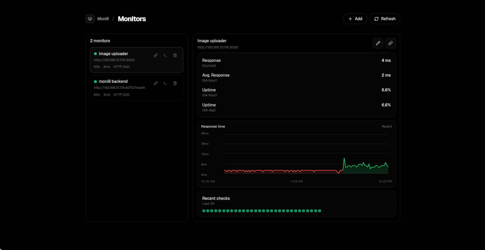

# moni8

A tiny uptime monitor (Uptime Kuma–like, but extremely minimal):
- interval-based HTTP checks (default 60s)
- add monitors via API + UI
- pass/fail history (green/red dots)

**Live:** [moni8.khushal.work](https://moni8.khushal.work)




## Run

### Backend
```bash
cd backend
npm install
npm run dev
```
Backend: http://localhost:4070

### Frontend
```bash
cd frontend
npm install
npm run dev -- --host 0.0.0.0 --port 4071
```
Frontend: http://localhost:4071

> Tip (LAN): open the UI via your machine IP (e.g. `http://192.168.31.176:4071`) so it works from other devices.

## API
- `GET /api/monitors`
- `POST /api/monitors` `{ name, url, intervalSec }`
- `DELETE /api/monitors/:id`
- `GET /api/monitors/:id/checks?limit=90`
